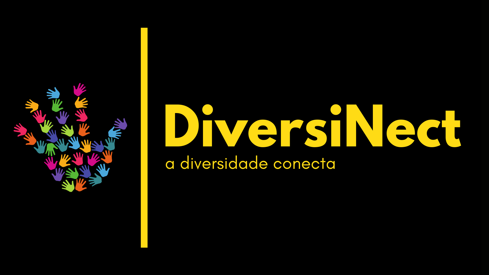

## DIVERSINECT - 🏳️‍🌈 A diversidade conecta 🏳️‍🌈

##### 🦄 Clique no botão a seguir para descobrir [Quem somos nós](./quem-somos.md) 🦄

✔️Sabemos que pessoas inseridas em grupos sub-representados (como o nome já diz), ocupam a minoria das vagas de emprego e de cargos de liderança / alta visibilidade, principalmente nas áreas STEMM.

✔️Com o objetivo de mitigar esta problemática, nós, uma equipe composta por homens, mulheres, pessoas não-binarie, negres e branques, participantes da No-Budget Science Hack Week 2021, propomos a criação de um banco de dados de profissionais pertencentes a um ou mais grupos sub-representados, para que jornalistas, outres pesquisadores, contratantes e etc, interessades em diversidade e inclusão, possam encontrar futuras pessoas para compor seu quadro de funcionários, bancas de defesa, colaboradores, etc.

Para começar, gostaríamos de saber se você poderia responder este rápido questionário para que possamos ser o mais assertives possível.

    🌈 QUESTIONÁRIO: https://forms.gle/zjd4kWfkJ54JeEWu6
    🌈 NOSSA PROPOSTA: https://drive.google.com/open?id=1_cnUXmu95_U1gxim2T3wBBiesbTFuzm7&authuser=flavia.virginio%40butantan.gov.br&usp=drive_fs
    
    
    📧 **Nossos links:**
    
    
    🏳️‍🌈 Linkedln: https://www.linkedin.com/groups/9081488/
    🏳️‍🌈 Telegram: https://t.me/diversinectchat
    🏳️‍🌈 Instagram:https://www.instagram.com/diversinect/
     

**Currículo da Mimi**

### Suporte e contatos

Falar com Adriana Cabanelas, Bruno Soares, Cristal Villalba, Flavia Virginio, Marília Reginato, Renata Porto e Vanessa Bicalho - através do [Telegram Chat DiversiNect](https://t.me/diversinectchat) . Para contatos por email, por favor encaminhar para Nosso Gmail  📧 diversinect@gmail.com
